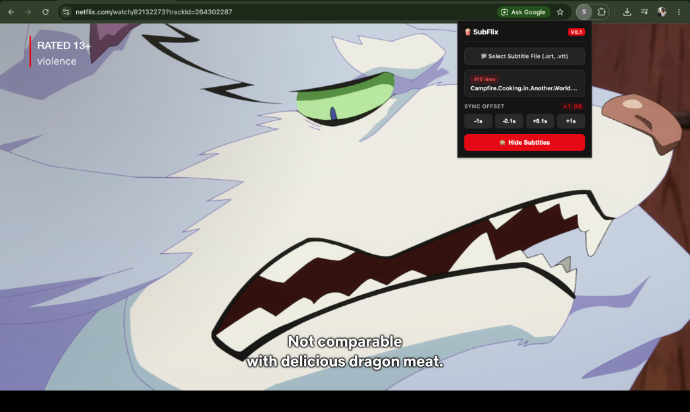

# SubFlix — Custom Subtitles for Netflix

A lightweight, high-performance browser extension (Manifest V3) that enables custom subtitle overlays (`.srt` or `.vtt`) on Netflix video playback with sub-second real-time sync offset controls.

Created by [**Zandaa1**](https://github.com/Zandaa1).

---

## 🖼️ Preview



---

## ✨ Features

- **Custom Subtitle Files**: Seamlessly parse and load `.srt` and `.vtt` subtitle files directly into Netflix player.
- **Real-Time Offset Sync**: Adjust subtitle timing on the fly (`-1s`, `-0.1s`, `+0.1s`, `+1s`) to eliminate audio/subtitle sync drift.
- **Visibility Toggle**: Easily toggle subtitle overlay visibility (Show/Hide) without clearing loaded subtitle data.
- **100% Private & Local**: Zero data collection, no external API dependencies, and 100% client-side execution.

---

## 🚀 Installation Guide

SubFlix can be installed in Chrome, Brave, Edge, or any Chromium-based browser:

1. Download or clone this repository:
   ```bash
   git clone https://github.com/Zandaa1/netflix-anime-subs.git
   ```
2. Open your browser's extensions page:
   - **Chrome**: `chrome://extensions`
   - **Brave**: `brave://extensions`
   - **Edge**: `edge://extensions`
3. Enable **Developer mode** (toggle in the top-right corner).
4. Click **Load unpacked** in the top-left menu.
5. Select the repository folder (`netflix-anime-subs`).
6. Pin **SubFlix** to your browser toolbar for easy access!

---

## 📖 How to Load & Sync Subtitles

1. **Start Playback**: Open [Netflix](https://www.netflix.com) and start playing your video.
2. **Open SubFlix**: Click the **SubFlix** extension icon in your browser toolbar.
3. **Load Subtitle File**:
   - Click **Choose File** and pick your `.srt` or `.vtt` file.
   - SubFlix will parse the file and confirm the number of loaded subtitle lines in the popup status.
4. **Subtitles Rendered**: Your custom subtitles will immediately render at the bottom center of the video player.
5. **Adjust Sync (If Subtitles Are Off)**:
   - If subtitles appear **too late** relative to audio, click **`-0.1s`** or **`-1s`**.
   - If subtitles appear **too early** relative to audio, click **`+0.1s`** or **`+1s`**.
6. **Toggle Subtitles**: Click **Hide subtitles** whenever you want to hide the overlay temporarily.

---

## ⚠️ Disclaimers & Credits

- **User-Provided Subtitles**: SubFlix does **not** provide, host, stream, bundle, or distribute any subtitle files or video media. Users must supply their own legally acquired `.srt` or `.vtt` subtitle files.
- **Anime & Media Creators**: Full credit and gratitude go to the original creators, production studios, animators, voice actors, and subtitle translators who create and localize anime and films.
- **Trademark Notice**: SubFlix is an independent, non-commercial open-source project. It is not affiliated with, endorsed by, or sponsored by Netflix, Inc., or any anime production company or distributor. All trademarks and copyrighted content belong to their respective owners.

---

## 🔒 Privacy Notice

- **No Tracking**: SubFlix does not collect, track, or share any personal information, browsing history, or analytics.
- **Local Parsing**: All subtitle files are parsed directly inside your browser memory and never leave your device.

---

## ☕ Support the Developer

If SubFlix makes your anime and movie watching better, consider supporting development!

[](https://ko-fi.com/zandaadev)

👉 [**https://ko-fi.com/zandaadev**](https://ko-fi.com/zandaadev)

---

## 📄 License

Distributed under the MIT License. Contributions and feedback are always welcome!
